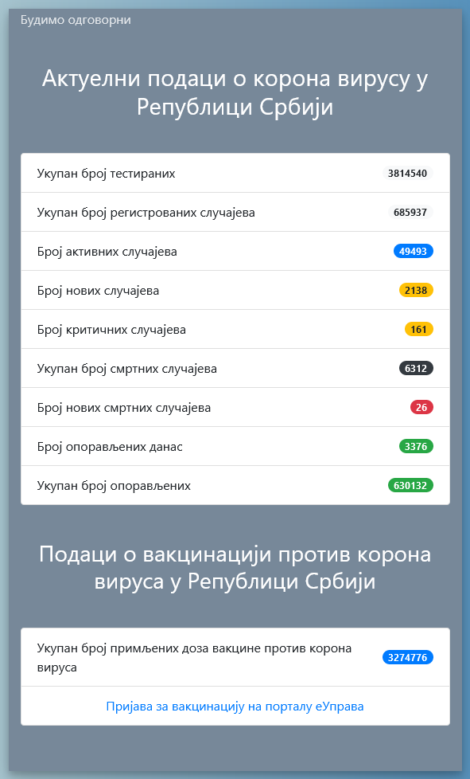

# COVID tracker Serbia

![Safe](https://img.shields.io/badge/Stay-Safe-red?logo=data:image/svg%2bxml;base64,PHN2ZyBpZD0iTGF5ZXJfMSIgZW5hYmxlLWJhY2tncm91bmQ9Im5ldyAwIDAgNTEwIDUxMCIgaGVpZ2h0PSI1MTIiIHZpZXdCb3g9IjAgMCA1MTAgNTEwIiB3aWR0aD0iNTEyIiB4bWxucz0iaHR0cDovL3d3dy53My5vcmcvMjAwMC9zdmciPjxnPjxnPjxwYXRoIGQ9Im0xNzQuNjEgMzAwYy0yMC41OCAwLTQwLjU2IDYuOTUtNTYuNjkgMTkuNzJsLTExMC4wOSA4NS43OTd2MTA0LjQ4M2g1My41MjlsNzYuNDcxLTY1aDEyNi44MnYtMTQ1eiIgZmlsbD0iI2ZmZGRjZSIvPjwvZz48cGF0aCBkPSJtNTAyLjE3IDI4NC43MmMwIDguOTUtMy42IDE3Ljg5LTEwLjc4IDI0LjQ2bC0xNDguNTYgMTM1LjgyaC03OC4xOHYtODVoNjguMThsMTE0LjM0LTEwMC4yMWMxMi44Mi0xMS4yMyAzMi4wNi0xMC45MiA0NC41LjczIDcgNi41NSAxMC41IDE1LjM4IDEwLjUgMjQuMnoiIGZpbGw9IiNmZmNjYmQiLz48cGF0aCBkPSJtMzMyLjgzIDM0OS42M3YxMC4zN2gtNjguMTh2LTYwaDE4LjU1YzI3LjQxIDAgNDkuNjMgMjIuMjIgNDkuNjMgNDkuNjN6IiBmaWxsPSIjZmZjY2JkIi8+PHBhdGggZD0ibTM5OS44IDc3LjN2OC4wMWMwIDIwLjY1LTguMDQgNDAuMDctMjIuNjQgNTQuNjdsLTExMi41MSAxMTIuNTF2LTIyNi42NmwzLjE4LTMuMTljMTQuNi0xNC42IDM0LjAyLTIyLjY0IDU0LjY3LTIyLjY0IDQyLjYyIDAgNzcuMyAzNC42OCA3Ny4zIDc3LjN6IiBmaWxsPSIjZDAwMDUwIi8+PHBhdGggZD0ibTI2NC42NSAyNS44M3YyMjYuNjZsLTExMi41MS0xMTIuNTFjLTE0LjYtMTQuNi0yMi42NC0zNC4wMi0yMi42NC01NC42N3YtOC4wMWMwLTQyLjYyIDM0LjY4LTc3LjMgNzcuMy03Ny4zIDIwLjY1IDAgNDAuMDYgOC4wNCA1NC42NiAyMi42NHoiIGZpbGw9IiNmZjRhNGEiLz48cGF0aCBkPSJtMjEyLjgzIDM2MC4xMnYzMGg1MS44MnYtMzB6IiBmaWxsPSIjZmZjY2JkIi8+PHBhdGggZD0ibTI2NC42NSAzNjAuMTJ2MzBoMzYuMTRsMzIuMDQtMzB6IiBmaWxsPSIjZmZiZGE5Ii8+PC9nPjwvc3ZnPg==)

##Data Sources

* [disease.sh](https://corona.lmao.ninja/) - An open API for disease-related statistics.

## Screenshot

